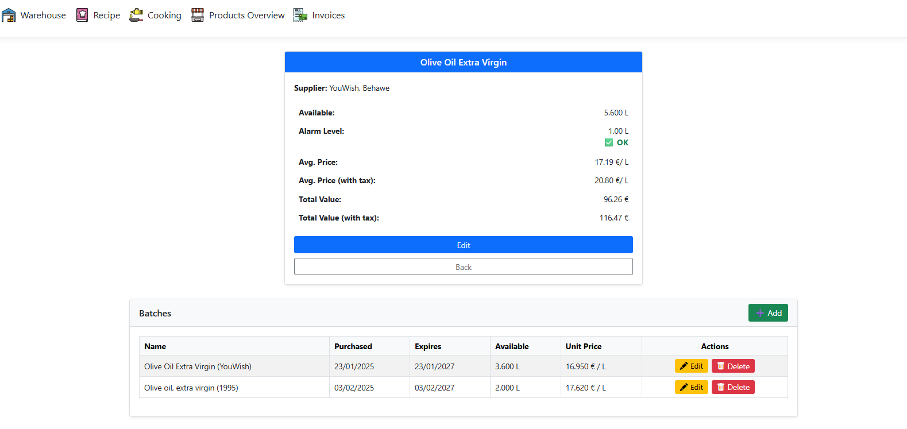

## 🛠 Tech Stack
- .NET 8.0 (LTS, released in November 2023) backend, developed in Visual Studio 2022
- Razor Pages with JavaScript (AI-assisted)
- UnitTests (XUnit, Moq, Microsoft.EntityFrameworkCore.InMemory)
- Azure SQL and Azure App Service hosting

#  🧼 SoapMate – Soap & Cosmetics Production System
SoapMate is a comprehensive system for managing cosmetics production, covering everything from inventory management, recipe tracking, and batch-based manufacturing, to cost calculation and sales management. It is designed to bring full traceability, precision, and automation to artisanal and small-scale cosmetics production.

##  🚀 Key Features
🔐 Authentication
- Secure login system required for all access.
- User-based permissions (future implementation possible).

## 📦 Inventory & Batches
- Each ingredient/product in stock is managed via batches.
- A batch includes:
  - Purchase source (supplier)
  - Expiry date
  - Purchase price
  - Quantity available
- Stock is FIFO-based (first expiring batches are used first).
- Unit price for recipes is calculated based on the actual batch used.

## 🧪 Recipes & Ingredients
- Recipes list required ingredients and their quantities.
- Real-time availability check:
  - You can only "cook" (start production) if all ingredients are available in sufficient quantity.
- Recipes automatically calculate total cost based on batch prices.
- Recipes are not editable if they are linked to a production log.

## 🧰 Production (Cooking)
- Once a recipe is started:
  - Ingredients are pulled from available batches.
  - A production log is created.
  - The system tracks:
   - Which batches were used
   - Quantities
   - Expiry dates
   - Cost breakdown
- Final products (e.g., soap bars) are divided into individual items.
  - Each unit has:
    - A cost per item (based on the full batch production)
    - Assigned expiry (based on used ingredients)

## 📄 PDF Generation
- Every production (cooking) generates a PDF report:
  - Ingredients used
  - Batch information
  - Quantities
  - Expiry dates
  - Total and per-unit costs
  - Assigned product expiry
- PDF is automatically stored with the batch record.

## 🛒 Sales (Coming Soon)
- Planned feature: link produced items to customer orders.
- Track sales by product, batch, and customer.

## 📊 Example Use Case
1. User logs in and selects a recipe.
2. System checks ingredient availability.
3. If everything is in stock, production is started.
4. Ingredients are deducted from batches (starting with the nearest expiration).
5. The system calculates the total production cost.
6. Soap bars are assigned unit prices and expirations.
7. A production PDF is created and saved.

## 🖼 Screenshots
### 📦 Warehouse

- **Warehouse Item List**  
  

- **Warehouse Filters & Category Select**  
  

- **Item Detail & Batch View**  
  

---

### 🧪 Recipes

- **Recipes Overview**  
  

- **Recipe Detail with Availability Check**  
  

---

### 🍳 Cooking (Production)

- **Cooking Process List**  
  

- **Start New Cooking (Select Recipe)**  
  

- **New Cooking Form with Cost Estimation**  
  

- **Cooking Batch Detail**  
  

- **PDF Generated After Cooking**  
  

- **Cooking Overview with Multiple Batches**  
  
